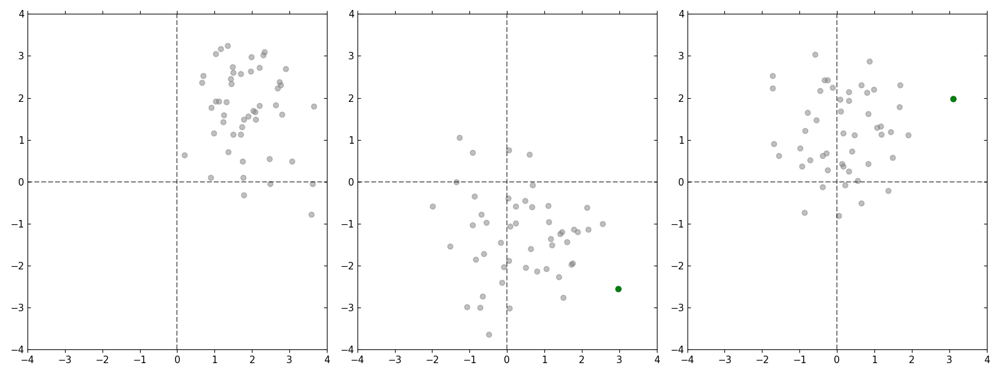

### Transformer Models 

Last update: June 2019.

---

Implementations of a few attention-based models in PyTorch.

We follow the notation of the Set Transformer [1], since much of our codebase was built on theirs.

**Attention**

For set of queries , keys , and values , we define [2]:

The interpretation is that each query  corresponds to a different feature, which is constructed as a convex combination of values , where the weights are given by the dot products between the query and the keys . To see this, we can expand:

where the softmax is applied row-by-row, corresponding to a softmax per query. [Note: In the above  corresponds to the weights over  that arise from softmax due to the -th query vector .]

We normalize by  (the dimensionality of the queries and keys) to prevent the dot products  from blowing up in value and thereby vanishing gradients of the softmax. [Note: Recall that if  and  then .]

**Multi-head attention block (MAB)**

The multi-head attention block takes queries  and values , and treats the values  as keys . It uses  heads to project the queries, keys, and values into  different embeddings through linear transforms. Then it applies attention to each of the  embeddings, concatenates the resulting features at the end, then adds it to the result of another feed-forward neural network at the end like a residual block.

Note that above  and  are trainable parameters. 

**Set attention block (SAB)**

This is just a MAB with self-attention over elements of the set.

**Induced set attention block (ISAB)**

To reduce the computational complexity of self-attention we replace the values with a set of  induced values. These values are determined by attending over  with a set of  inducing points  as query vectors. 

**Pooling by multi-head attention (PMA)**

After applying layers of set attention blocks, we want to pool the output into a set of  elements. To do so we learn a set of  seed vectors  and which are queried over the elements .

#### Example

In the below example we try to regress onto the element in each dataset with the largest norm.

#### References

[1] Lee, J., Lee, Y., Kim, J., Kosiorek, A., Choi, S., and Teh, Y.W. (2019). Set Transformer: A Framework for Attention-based Permutation-Invariant Neural Networks. In International Conference on Machine Learning, pp. 3744–3753.

[2] Vaswani, A., Shazeer, N., Parmar, N., Uszkoreit, J., Jones, L., Gomez, A.N., Kaiser, Ł., and Polosukhin, I. (2017). Attention is All you Need. In Advances in Neural Information Processing Systems 30, I. Guyon, U.V. Luxburg, S. Bengio, H. Wallach, R. Fergus, S. Vishwanathan, and R. Garnett, eds. (Curran Associates, Inc.), pp. 5998–6008.
